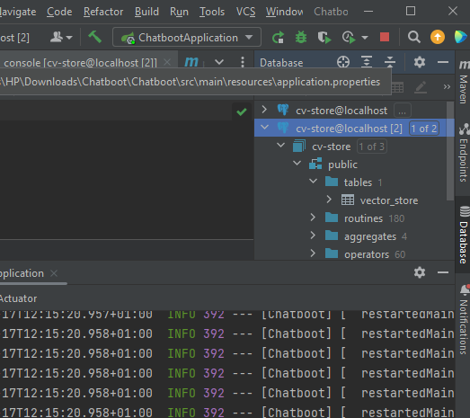
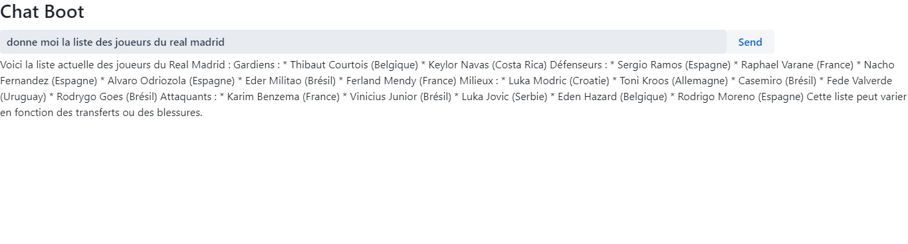
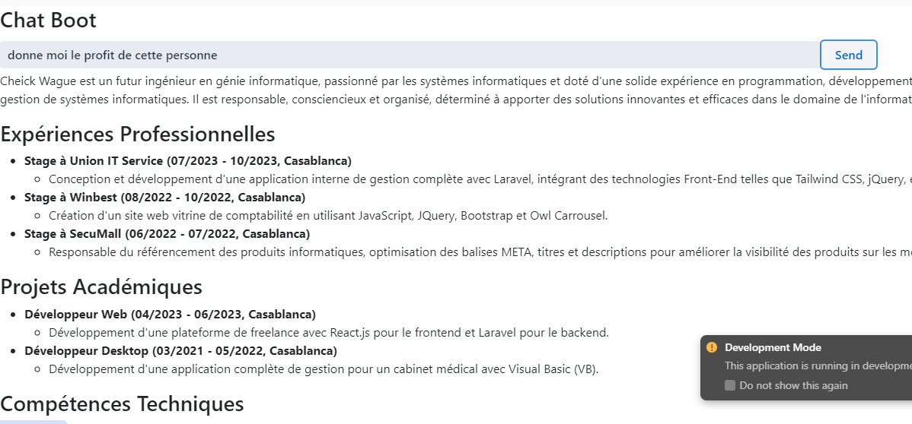

#  Chat Boot RAG Spring React
Application web fullstack Spring React qui permet mettre en oeuvre un Chat Bot Basé sur un système RAG avec les LLMs llama3 et openAI. L'application utilise Spring AI coté backend et React coté Frontend en utilisant VAADIN.

# Base de donnée utilisé pour la partie rag

# Exemple 1 de reponse du chatbbot

# Exemple2 de reponse du chatbbot

